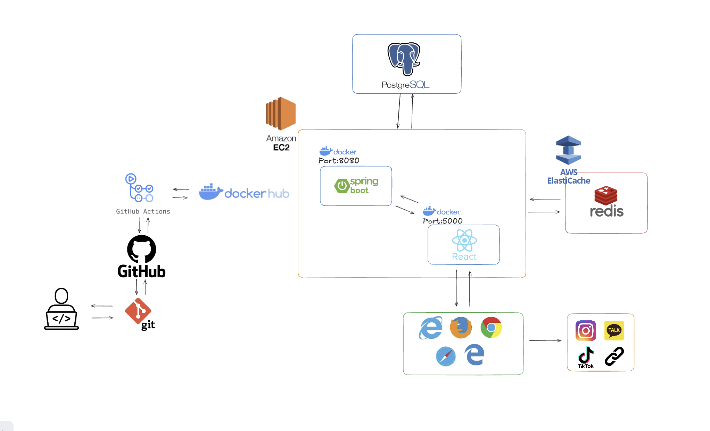
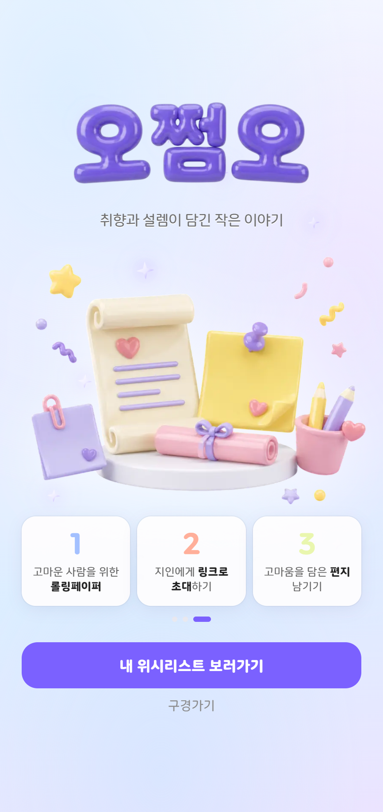
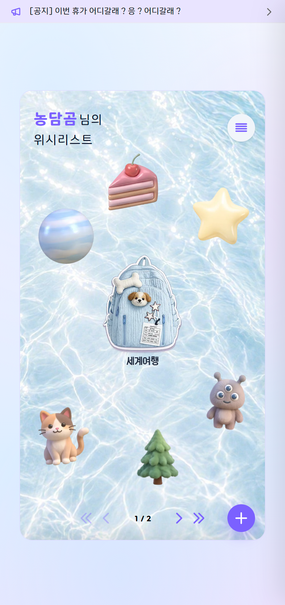
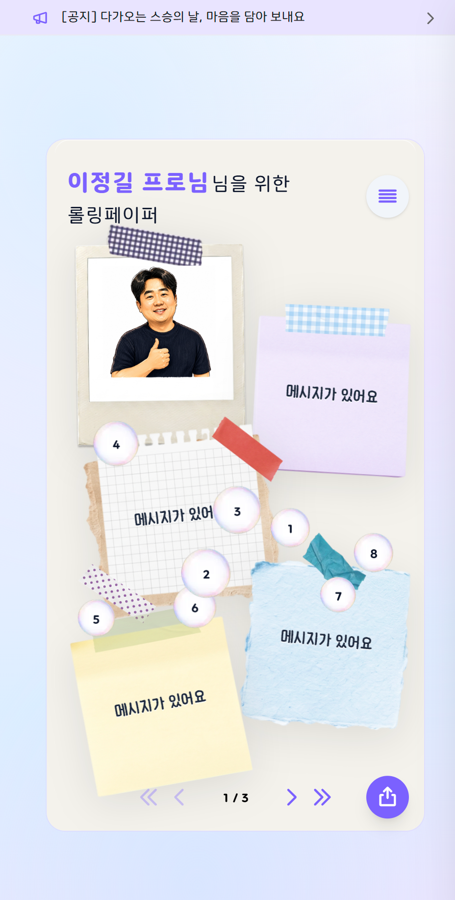
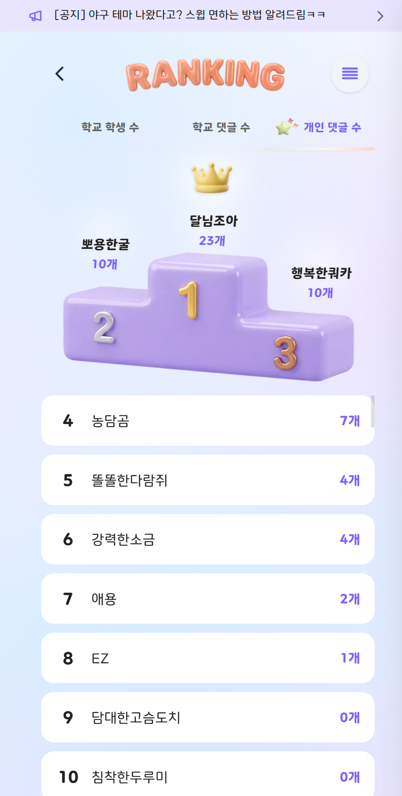
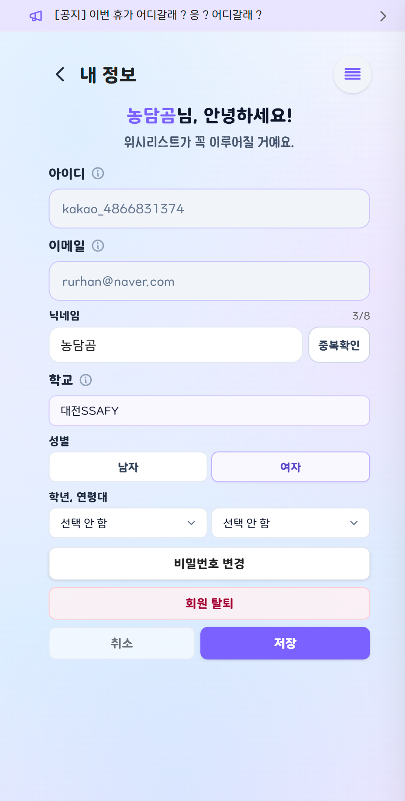
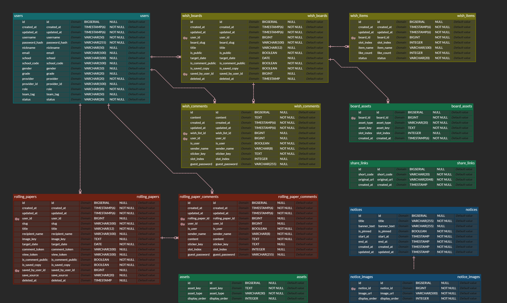

<div align="center">
  
</div>

<div align="center">
  <h3>소중한 마음을 모으는 선물·응원 서비스, 오쩜오</h3>
  <h4>위시보드와 롤링페이퍼로 <b>생일·기념일 응원</b>을 나누는 웹 서비스입니다.</h4>
  <p><a href="https://fivedotfive.co.kr">https://fivedotfive.co.kr</a></p>
</div>

<br/>

- **개발 기간** : 2026.04.06 ~ 2026.06.02 (8주주)
- **플랫폼** : Web
- **개발 인원** : 6명
- **기관** : 삼성 청년 SW · AI 아카데미 14기 (S14P31F205)

<br/>

---

## 🔎 목차

- [🙌 팀원 구성](#-팀원-구성)
- [🪄 기술 스택](#-기술-스택)
- [🛠️ 아키텍처](#-아키텍처)
- [📲 기능 구성](#-기능-구성)
- [📂 디렉터리 구조](#-디렉터리-구조)
- [📦 프로젝트 산출물](#-프로젝트-산출물)
- [🔀 브랜치 전략](#-브랜치-전략)

---

## 🙌 팀원 구성

> 역할 설명은 팀 내 분담에 맞게 수정해 주세요.

<table align="center">
  <tr>
    <td align="center" width="200" style="vertical-align:bottom;">
      <div style="height:280px;display:flex;align-items:center;justify-content:center;">
        
      </div>
      <br/>
      <b>박서연</b>
      <p style="margin: 4px 0 0 0; color: #666; font-size: 14px;">프론트엔드</p>
    </td>
    <td align="center" width="200" style="vertical-align:bottom;">
      <div style="height:280px;display:flex;align-items:center;justify-content:center;">
        
      </div>
      <br/>
      <b>최연제</b>
      <p style="margin: 4px 0 0 0; color: #666; font-size: 14px;">백엔드<p>
    </td>
    <td align="center" width="200" style="vertical-align:bottom;">
      <div style="height:280px;display:flex;align-items:center;justify-content:center;">
        
      </div>
      <br/>
      <b>김민경</b>
      <p style="margin: 4px 0 0 0; color: #666; font-size: 14px;">프론트엔드</p>
    </td>
  </tr>
  <tr>
    <td align="center" width="200" style="vertical-align:bottom;">
      <div style="height:280px;display:flex;align-items:center;justify-content:center;">
        
      </div>
      <br/>
      <b>김이</b>
      <p style="margin: 4px 0 0 0; color: #666; font-size: 14px;">백엔드 · 인프라<p>
    </td>
    <td align="center" width="200" style="vertical-align:bottom;">
      <div style="height:280px;display:flex;align-items:center;justify-content:center;">
        
      </div>
      <br/>
      <b>여이지</b>
      <p style="margin: 4px 0 0 0; color: #666; font-size: 14px;">프론트엔드</p>
    </td>
    <td align="center" width="200" style="vertical-align:bottom;">
      <div style="height:280px;display:flex;align-items:center;justify-content:center;">
        
      </div>
      <br/>
      <b>이다연</b>
      <p style="margin: 4px 0 0 0; color: #666; font-size: 14px;">프론트엔드</p>
    </td>
  </tr>
</table>

---

## 🪄 기술 스택

<div align="center">

### 🫡 Frontend


<table>
  <tr><th>Category</th><th>Specification</th></tr>
  <tr><td><b>Framework</b></td><td>Next.js 16.2.4 (App Router)</td></tr>
  <tr><td><b>UI</b></td><td>React 19.2.4</td></tr>
  <tr><td><b>Language</b></td><td>TypeScript 5.x</td></tr>
  <tr><td><b>State</b></td><td>Zustand 5.0.12</td></tr>
  <tr><td><b>CSS</b></td><td>Tailwind CSS 4.x</td></tr>
  <tr><td><b>Icons</b></td><td>@phosphor-icons/react 2.1.10</td></tr>
  <tr><td><b>Image Export</b></td><td>html-to-image, canvas-confetti</td></tr>
  <tr><td><b>Node.js (Docker)</b></td><td>24 Alpine</td></tr>
</table>

### 🤓 Backend


<table>
  <tr><th>Category</th><th>Specification</th></tr>
  <tr><td><b>Framework</b></td><td>Spring Boot 3.5.13</td></tr>
  <tr><td><b>Java</b></td><td>21 (Eclipse Temurin)</td></tr>
  <tr><td><b>Build</b></td><td>Gradle 8.14.4 (Wrapper)</td></tr>
  <tr><td><b>Database</b></td><td>PostgreSQL 16, Flyway</td></tr>
  <tr><td><b>Cache</b></td><td>Redis 7 (Refresh Token, 랭킹 캐시)</td></tr>
  <tr><td><b>ORM</b></td><td>Spring Data JPA</td></tr>
  <tr><td><b>Auth</b></td><td>Spring Security, JWT (jjwt 0.12.6), Kakao OAuth2</td></tr>
  <tr><td><b>Storage</b></td><td>AWS S3 (에셋·업로드)</td></tr>
  <tr><td><b>Mail</b></td><td>Spring Mail (Gmail SMTP)</td></tr>
</table>

### 🥱 DevOps


<table>
  <tr><th>Category</th><th>Specification</th></tr>
  <tr><td><b>CI/CD</b></td><td>GitLab CI/CD</td></tr>
  <tr><td><b>Registry</b></td><td>GitHub Container Registry (GHCR)</td></tr>
  <tr><td><b>Deploy</b></td><td>AWS EC2, Docker Compose</td></tr>
  <tr><td><b>Reverse Proxy</b></td><td>Caddy (HTTPS, Blue/Green 전환)</td></tr>
  <tr><td><b>Strategy</b></td><td>backend-blue / backend-green 무중단 배포 (<code>infra/deploy.sh</code>)</td></tr>
</table>

### 😀 Collaboration


</div>

---

## 🛠️ 아키텍처



> 상세 배포 구성은 [exec/01-porting-manual.md](./exec/01-porting-manual.md) 참고.

---

## 📲 기능 구성

<div align="center">

<table>
  <tr>
    <td align="center" width="20%"><b>메인 랜딩</b></td>
    <td align="center" width="20%"><b>위시보드</b></td>
    <td align="center" width="20%"><b>롤링페이퍼</b></td>
    <td align="center" width="20%"><b>랭킹</b></td>
    <td align="center" width="20%"><b>마이페이지</b></td>
  </tr>
  <tr>
    <td align="center" style="vertical-align:top;padding:4px;">
      
    </td>
    <td align="center" style="vertical-align:top;padding:4px;">
      
    </td>
    <td align="center" style="vertical-align:top;padding:4px;">
      
    </td>
    <td align="center" style="vertical-align:top;padding:4px;">
      
    </td>
    <td align="center" style="vertical-align:top;padding:4px;">
      
    </td>
  </tr>
</table>

</div>

**주요 기능**

- **위시보드**: 소원 아이템·배경·스티커 꾸미기, slug 공유, targetDate 기반 댓글 공개
- **롤링페이퍼**: 댓글/저장용 공유 링크(token), 비회원 댓글·PNG 저장, 저장본 관리
- **인증**: 아이디·비밀번호 회원가입/로그인, 카카오 OAuth, 비밀번호 재설정
- **랭킹**: 개인·학교(팀) 댓글 랭킹 (Redis 캐시)
- **공지·에셋**: 공지 CRUD, S3 에셋 동기화·카탈로그 API
- **관리자**: ADMIN 계정, 위시보드/롤링 시드·에셋 sync

---

## 📂 디렉터리 구조

### GitLab Repository (모노레포)

<details>
<summary>apps/client — Next.js 프론트엔드</summary>

```
apps/client/
├── app/                 # App Router 페이지 (wishlist, rolling-paper, ranking, …)
├── components/          # 공통·도메인 UI 컴포넌트
├── features/            # API·hooks·types (도메인별)
├── lib/                 # 유틸·상수
├── public/              # 정적 리소스
├── store/               # Zustand
├── Dockerfile
└── package.json
```

</details>

<details>
<summary>apps/server — Spring Boot 백엔드</summary>

```
apps/server/
├── src/main/java/com/ssafy/oh_jjeom_oh/
│   ├── common/          # config, init, security, exception
│   └── domain/
│       ├── auth/        # 로그인·JWT·OAuth
│       ├── user/        # 회원
│       ├── board/       # 위시보드·댓글·아이템
│       ├── rollingpaper/
│       ├── asset/       # S3 에셋 카탈로그
│       ├── ranking/
│       ├── notice/
│       ├── share/       # 단축 공유 링크
│       ├── me/
│       └── file/
├── src/main/resources/db/migration/   # Flyway
├── Dockerfile
└── build.gradle
```

</details>

<details>
<summary>infra — 배포·Compose</summary>

```
infra/
├── docker-compose.yml       # 운영 (postgres, redis, client, blue/green api)
├── docker-compose.local.yml # 로컬 DB/Redis
├── deploy.sh                # Blue/Green 배포
├── Caddyfile
└── .env.example
```

</details>

<details>
<summary>exec — SSAFY 제출 문서</summary>

```
exec/
├── 01-porting-manual.md
├── 02-demo-scenario.md
├── schema.sql
└── screenshots/
```

</details>

---

## 📦 프로젝트 산출물

| 산출물               | 경로                                                     |
| -------------------- | -------------------------------------------------------- |
| 포팅 매뉴얼          | [exec/01-porting-manual.md](./exec/01-porting-manual.md) |
| 테스트·시연 시나리오 | [exec/02-demo-scenario.md](./exec/02-demo-scenario.md)   |
| DB schema-only       | [exec/schema.sql](./exec/schema.sql)                     |
| ERD                  |                                    |

---

## 🔀 브랜치 전략

Git Flow · Conventional Commits · MR 템플릿 규칙은 [docs/branch-strategy.md](./docs/branch-strategy.md) 를 참고하세요.
